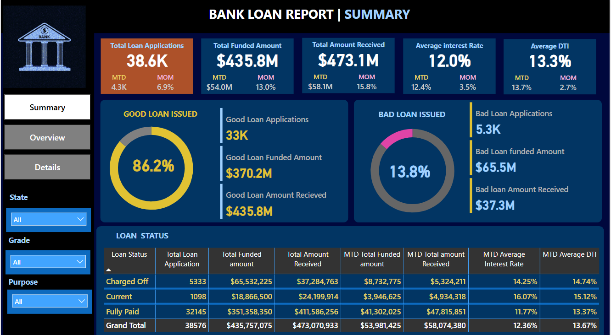
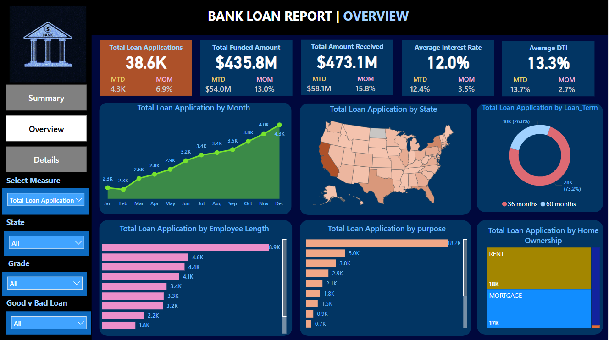
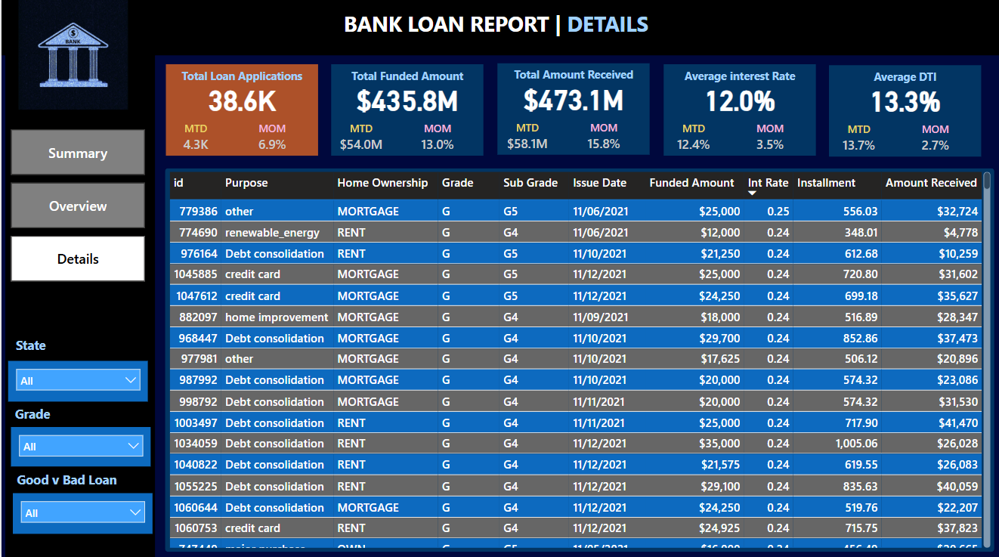

# Bank Loan Analytics Dashboard using Power BI

## Project Overview
This project is an interactive Bank Loan Analytics Dashboard developed using Power BI to analyze and monitor banking loan performance. The dashboard provides insights into loan applications, funded amounts, repayments, customer demographics, and financial risk indicators.

The solution helps stakeholders make data-driven decisions by identifying lending trends, borrower behavior, and overall portfolio performance.

---

# Key Performance Indicators (KPIs)

The dashboard tracks the following business metrics:

- Total Loan Applications
- Month-to-Date (MTD) Loan Applications
- Total Funded Amount
- Total Amount Received
- Average Interest Rate
- Debt-to-Income (DTI) Ratio
- Loan Approval & Rejection Trends
- Month-over-Month (MoM) Analysis

---

# Dashboard Features

Loan Performance Analysis
- Track loan disbursement and repayment trends
- Analyze approved vs rejected loans
- Monitor funded amounts across multiple periods

Customer Segmentation
Analyze customers based on:
- Home Ownership
- Income Category
- Loan Purpose
- Employment Length

Regional Analysis
- Compare loan performance across regions and states
- Identify high-performing and high-risk areas

Financial Risk Monitoring
- Analyze borrower DTI ratios
- Monitor interest rate trends
- Identify risky lending patterns

Interactive Reporting
- Dynamic filters and slicers
- Drill-down analysis
- Interactive KPI visualizations

---

# Business Insights Generated

- Identified trends in loan approvals and disbursals
- Analyzed customer borrowing behavior
- Evaluated regional lending performance
- Monitored repayment efficiency and financial risk
- Generated actionable insights for banking decision-making

---

# Project Highlights

- Developed an end-to-end BFSI analytics dashboard
- Created dynamic and interactive visualizations
- Implemented advanced DAX calculations
- Performed data transformation and validation
- Designed KPI-driven reporting dashboards

---

# Dashboard Screenshots

## Loan Report Summary

---

## Loan Report Overview

---

## Loan Report Details

---
